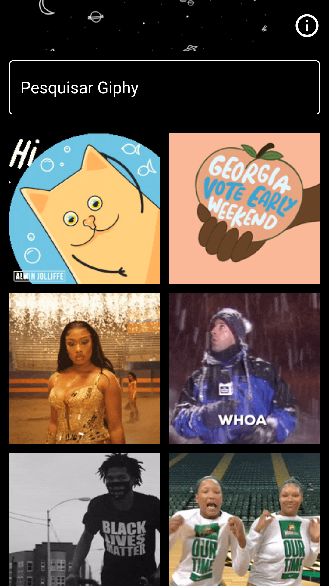
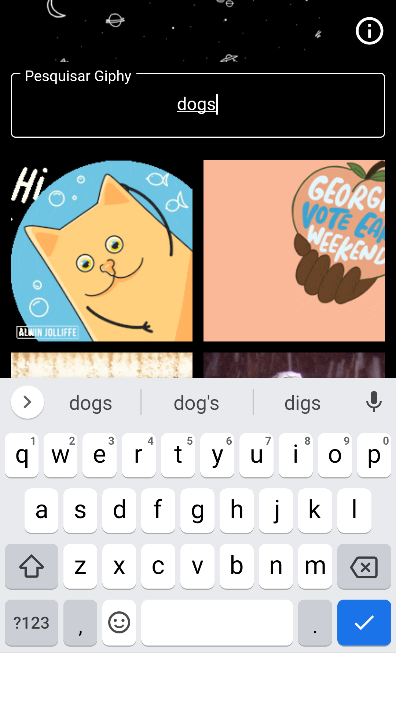
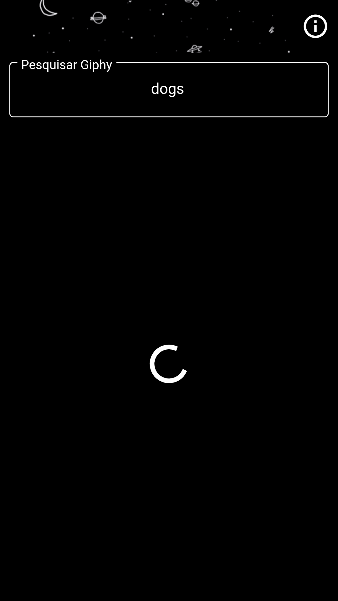
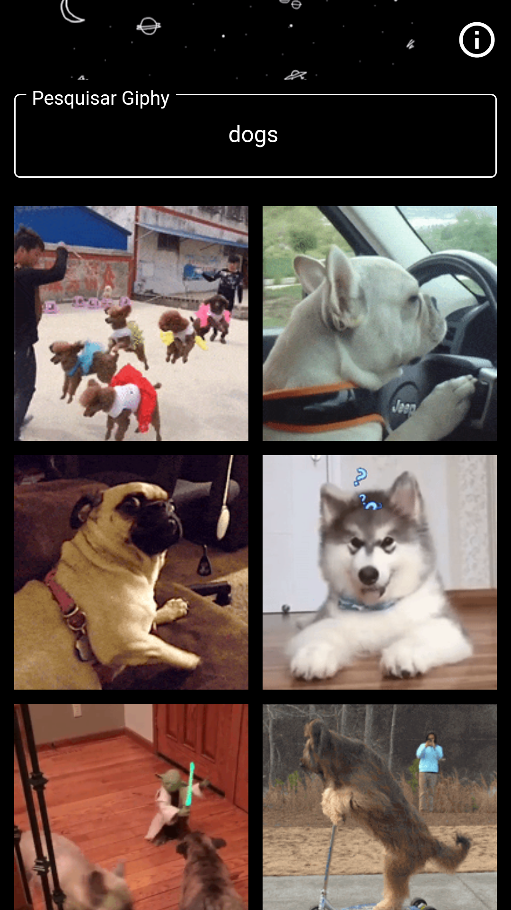
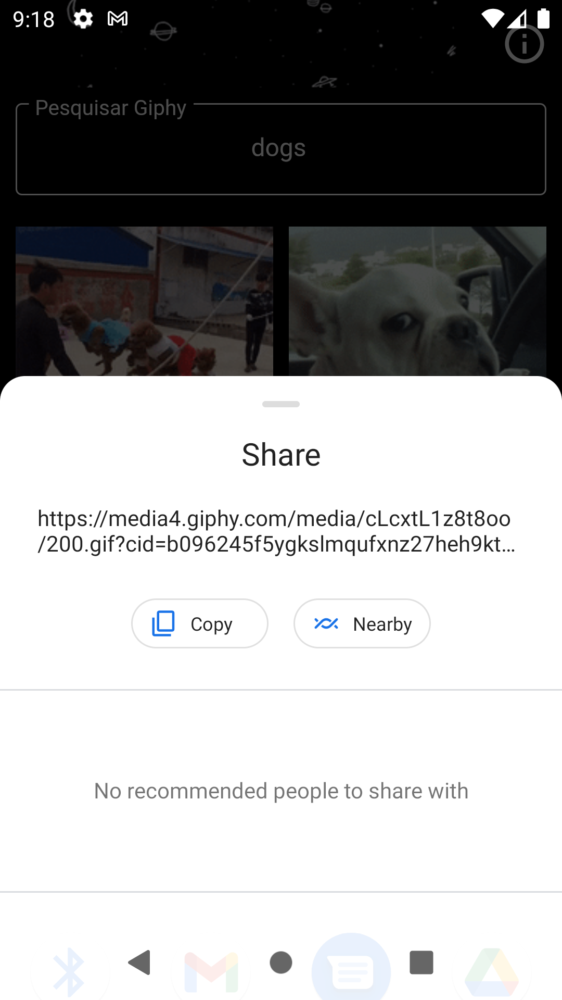

# Images from project

## Home Screen

<table>
<tr>
    <th>
        
    </th>
    <th>
         
    </th>
</tr>
<tr>
    <th>
        
    </th>
    <th>
        
    </th>
</tr>
</table>

## Share Gifs

    Share GIFs on the home screen with a long press on the picture
 

    

 

    Share gifs in gif screen by clicking in the icon share
 

    

 

## About
    GIPHY's api was used, just taking the best gifs of the day if the "search" field is empty, or returning the search

### TODO APP

- [x] SEARCH EMPTY BUG
- [ ] IMPLEMENT A GIPHY RANDOM